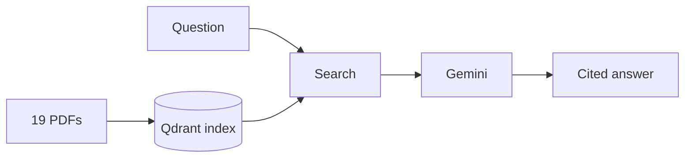

# MyUniGuide V2

Ask about German university examination regulations, in German or English. Every
answer cites the rule it came from — or says the rule isn't there.

[V1](https://github.com/rohanajay247/myuniguide) was built from scratch on four
real documents. V2 takes the same problem in a different direction: production
frameworks instead of hand-rolled code, and a purpose-built corpus designed so
that conflict detection and refusal behaviour can actually be measured.

🔗 **[Live demo](https://myuniguide-v2-703440239913.europe-west1.run.app)** ·
[Build log](docs/PROGRESS.md)

---

## The result

Before building, I measured the simplest possible alternative: paste all 19
documents into one prompt and ask. That's the **baseline**.

|                              | This system | Baseline |
| ---------------------------- | ----------- | -------- |
| Correct overall              | 90.3%       | 93.1%    |
| **Genuine conflicts caught** | **2 / 4**   | 1 / 4    |
| Made-up answers              | **0**       | **0**    |
| Cost per question            | **$0.0012** | $0.028   |

Overall accuracy is a tie — 2.8 points sits inside the ±3 noise band of a
72-question benchmark. Where the two diverge is the thing this project is
actually about.

**On genuine conflicts, retrieval wins.** The baseline answered three of four
real contradictions by silently picking a side. It has no way not to: it sees
every document at once, with no notion of which one outranks which, so a
contradiction just looks like more text. This system knows each provision's
authority level and can say _these two rules disagree and neither overrides the
other_.

**And it costs 23x less per question.** At 296 pages the baseline is affordable.
At ten times that it is not, and past roughly 2,500 pages it stops running
altogether.

So the finding is the same one V1 turned up, now with a bigger corpus and
clearer evidence: **at this size retrieval does not buy accuracy — it buys the
ability to say the documents disagree, at a twenty-third of the price.**

---

## What changed from V1

**What a user gets**

|                             | V1                      | V2                                                                                     |
| --------------------------- | ----------------------- | -------------------------------------------------------------------------------------- |
| Ask in German               | answers in English      | **answers in German**                                                                  |
| Ask in English              | answers in English      | **answers in English**                                                                 |
| Quoted provisions           | translated into English | **left in the original** — a translated legal quote isn't a citation                   |
| Two rules disagree          | says they disagree      | says whether it's a real contradiction or one rule **legitimately overriding** another |
| Question names no programme | picks one               | **answers for each**, saying which is which                                            |
| Fabricated answers          | 2                       | **0**                                                                                  |

**What's underneath**

|                             | V1                                                                           | V2                                                                                 |
| --------------------------- | ---------------------------------------------------------------------------- | ---------------------------------------------------------------------------------- |
| Corpus                      | 4 documents, 59 pages                                                        | 19 documents, 296 pages                                                            |
| Benchmark                   | 50 questions                                                                 | 72 questions, 19 categories                                                        |
| Authority between documents | not modelled                                                                 | every chunk ranked: general < programme-specific < handbook                        |
| Amendments                  | not modelled — V1's worst failure was answering from a superseded regulation | amendment targets tracked; both versions surfaced                                  |
| Retrieval                   | dense only, after comparing 4 configs                                        | hybrid dense + BM25, after comparing 5                                             |
| Cost / latency per query    | not measured                                                                 | $0.0012 · 3.5s, traced per step                                                    |
| Tests                       | —                                                                            | 44, including one that fails the build if the answering code can reach the answers |

**The two numbers not compared here are the accuracy scores.** Different corpus,
different questions — 84% and 90.3% are not the same exam, and putting them side
by side would be meaningless.

**What is comparable is behaviour.** V1 fabricated two answers on its benchmark.
V2 has fabricated none, across every run. V1 could report that two documents
disagreed; V2 can work out whether the disagreement is a real contradiction or
one rule legitimately overriding another — which is the distinction that decides
whether a student should act on the answer or go and ask someone.

---

## What it does

Three answers, not one:

- **ANSWER** — cites the provision
- **DECLINE** — the rule isn't in the documents, so it says so
- **CONFLICT** — two rules genuinely contradict; it quotes both and picks neither

The third one is the hard part. German regulations override each other
constantly: programme rules beat general rules, amendments beat what they amend.
Most apparent contradictions are legitimate. A few are real. Telling them apart
is the project.

**Zero made-up answers across every test run.** For a system about exam rules,
refusing is the safe way to fail.

---

## How it works



**Docling** reads page layout, so section headings survive as headings.

**Chunking** puts one § per chunk. Harder than it sounds: the two universities
format headings differently, amendments point at sections in _other_ documents,
and footnotes must stay attached to the tables they annotate.

**Search** runs two kinds at once. Vector search understands meaning, so an
English question finds German text. Keyword search (BM25) matches exact strings
like `§ 28`, which vector search blurs. Qdrant merges both.

**Gemini** returns structured output validated against a schema, so it can't
return something malformed. Answers match the question's language — but quoted
provisions are never translated, because a translated legal quote isn't a
citation.

---

## What I tried and dropped

| Setup                           | Correct   |
| ------------------------------- | --------- |
| Vector search only              | 76.4%     |
| Keyword search only             | 76.4%     |
| Both                            | 81.9%     |
| Both + reranker                 | 77.8%     |
| **Both, more chunks — shipped** | **86.1%** |

A **reranker** re-scores retrieved chunks more carefully. It's in every tutorial.
It made things worse: it scores each chunk on its own, so when an answer needs
five _different_ chunks it keeps the five most similar to the question and throws
the rest away. Counting and aggregation questions collapsed.

The fix was simpler. Keyword search alone was finding more of the needed
documents than the combined version — the merge step was losing them. So instead
of adding a component, I just retrieved more chunks. Bigger gain, no new code.

---

## The lesson

The conflict detector kept getting one question wrong. Four prompt revisions
moved the score to 2/5, 3/5, 2/5, 2/5 — noise, which is itself the signal: if
rewriting the instructions changes nothing, the instructions aren't the problem.

The real problem was a regex. One document is an English study plan, and my
detection only matched German headings — so it parsed wrong, its footnotes came
apart from its tables, and the footnote with the conflicting rule was never
found. The model was reasoning correctly about the wrong documents.

A one-line regex fix did what four prompt revisions couldn't. Three bugs in this
project had that shape — a German-only assumption in a bilingual corpus,
surfacing downstream as something that looked like a reasoning failure.

---

## What doesn't work

**7 of 72 questions fail** — 5 refusals, 2 misjudged conflicts, 0 made-up
answers.

- **Version resolution is out of scope.** Some rules changed by amendment and
  apply to some student years but not others. The system shows both versions
  instead of working out which is yours.
- **Workload questions cite the wrong thing.** They calculate correctly but cite
  the table without the rule behind it, because that rule is never retrieved.
- **The benchmark and corpus are both mine**, which biases them toward what I
  thought to test.
- **±3 points of noise** at 72 questions. Smaller differences don't mean
  anything.

---

## The corpus

Two fictional universities, 19 documents, 296 pages. **Not real regulations.**

Synthetic was necessary. Real regulations don't come labelled with which
contradictions are genuine or which questions are unanswerable — and without
those labels, none of this is measurable. Mine has 4 real conflicts, 8
legitimate overrides and 8 unanswerable questions, all known in advance.

**The system never sees the answers.** They live outside the repo, and a test
fails the build if the answering code mentions them.

---

## Running it

```bash
uv sync
cp .env.example .env          # add GOOGLE_API_KEY
docker compose up -d          # Qdrant

uv run python scripts/ingest_all.py --reset
uv run uvicorn myuniguide.api:app --reload
```

```bash
uv run python -m eval.run_benchmark          # 72 questions
uv run python -m eval.scorer --no-judge      # score them
uv run python -m eval.baseline_longcontext   # the baseline
uv run pytest -q                             # 44 tests
```

---

## Stack

Docling · LlamaIndex · Qdrant · LangGraph · Pydantic · Gemini · Langfuse ·
FastAPI · Docker · Cloud Run

V1 was built from scratch to learn the fundamentals. V2 uses frameworks, and the
honest verdict is mixed: Qdrant made the search comparison a config flag instead
of three code paths, and Langfuse gave per-question cost for free. LangGraph
added nothing to accuracy — two `if` statements would do the same. It's there
because the pattern is worth knowing.
